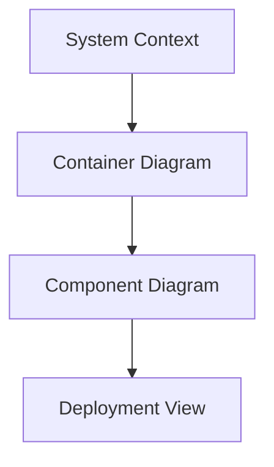

# Task Management Web App Pipeline

Welcome to the **Task Management Web App Pipeline** repository! This project provides a modular, beginner-friendly workflow to build, test, secure, and deploy a robust task management web application using the Claude.ai CLI. The pipeline leverages modern tools like Node.js, React, MongoDB Atlas, GitHub Actions, SonarQube, Snyk, OWASP ZAP, and Docker, deployed on AWS EC2.

**Author:** Lalatendu Swain | [GitHub](https://github.com/Lalatenduswain) | [Website](https://blog.lalatendu.info/)

---

## 📌 Features

- **Modular Workflow**: Organized Markdown files (`plan.md`, `frontend.md`, etc.) for each development phase, processed via Claude.ai CLI.
- **Full-Stack App**: Node.js/Express.js backend with MongoDB Atlas, React frontend with Tailwind CSS.
- **Testing**: Unit and integration tests with Jest and React Testing Library, plus API tests with Supertest and Postman.
- **Security**: Code quality scans with SonarQube, dependency checks with Snyk, and penetration testing with OWASP ZAP.
- **CI/CD**: Automated build, test, and deployment using GitHub Actions.
- **Deployment**: Dockerized app deployed to AWS EC2 with Nginx reverse proxy.
- **Monitoring**: Logging with Winston, metrics with Prometheus, and dashboards with Grafana.
- **Documentation**: User and developer guides generated for easy onboarding.
- **Interactive Script**: `run-pipeline.sh` provides a menu to select tasks (e.g., `1` for planning, `2` for frontend).

---

## 📖 Installation Guide

### Prerequisites

Before running the pipeline, ensure the following tools and accounts are set up:

- **Node.js v20**: Install from [nodejs.org](https://nodejs.org/en/download/).
  - Verify: `node -v` (should output `v20.x.x`).
- **Docker**: Install [Docker Desktop](https://www.docker.com/products/docker-desktop/) or server version.
  - Verify: `docker --version`.
  - Ensure Docker daemon is running: `sudo systemctl start docker`.
- **Git**: Install with `sudo apt install git` (Ubuntu) or equivalent.
  - Verify: `git --version`.
- **Claude.ai CLI**: Follow setup instructions at [docs.anthropic.com](https://docs.anthropic.com/).
  - Configure API key in `~/.claude/config`.
- **GitHub Account**: Create a repository at [github.com/new](https://github.com/new).
- **MongoDB Atlas**: Sign up at [mongodb.com/cloud/atlas](https://www.mongodb.com/cloud/atlas).
- **AWS Account**: Set up EC2 instance via [aws.amazon.com/free](https://aws.amazon.com/free/).
- **Snyk CLI**: Install with `npm install -g snyk` and authenticate (`snyk auth`).
- **OWASP ZAP**: Install from [zaproxy.org](https://www.zaproxy.org/download/).
- **SonarQube**: Access a server (e.g., `http://sonar.example.com`) or set up locally with Docker.
  - Example: `docker run -d -p 9000:9000 sonarqube:10.6-community`.
- **Text Editor**: Recommended: VS Code with JavaScript, Docker, and Markdown extensions.
- **Permissions**: Some commands require `sudo` (e.g., Docker, file permissions).
- **Bash**: Ensure a Bash-compatible shell (`bash --version`).

### Clone the Repository

Clone the repository to your local machine:

```bash
git clone https://github.com/Lalatenduswain/AI-PIPELINE-CLAUDE.AI-CLI.git
cd AI-PIPELINE-CLAUDE.AI-CLI
```

### Directory Structure

```
run-pipeline/
├── pipeline/             # Markdown files for tasks
│   ├── plan.md          # Project planning
│   ├── frontend.md      # Frontend development
│   ├── backend.md       # Backend development
│   ├── database.md      # Database setup
│   ├── test.md          # Unit/integration tests
│   ├── api-test.md      # API testing
│   ├── code-review.md   # Code quality review
│   ├── security.md      # Security checks
│   ├── ci-cd.md         # CI/CD pipeline
│   ├── deploy.md        # Deployment setup
│   ├── monitor.md       # Monitoring setup
│   ├── update.md        # Dependency updates
│   ├── docs.md          # Documentation
│   ├── push.md          # Git operations
├── src/                  # Source code
│   ├── client/           # React frontend
│   ├── server/           # Node.js backend
│   ├── tests/            # Tests
├── docs/                 # Documentation
├── scripts/              # Automation scripts
├── reports/              # Security/quality reports
├── .github/workflows/    # CI/CD workflows
├── run-pipeline.sh       # Task selection script
```

### Install Dependencies

1. **Create directories**:
   ```bash
   mkdir -p pipeline src/client src/server src/tests docs scripts reports .github/workflows
   ```

2. **Copy Markdown files**:
   - Place the provided Markdown files (`plan.md`, `frontend.md`, etc.) in `pipeline/`.
   - Ensure `run-pipeline.sh` is in the root directory.

3. **Set script permissions**:
   ```bash
   chmod +x run-pipeline.sh
   ```

4. **Install Node.js dependencies** (after generating code):
   - Backend: `cd src/server && npm install`.
   - Frontend: `cd src/client && npm install`.

### Configure Environment

1. **MongoDB Atlas**:
   - Create a cluster and obtain the connection string (e.g., `mongodb+srv://dummyuser:<password>@cluster0.mongodb.net/taskapp`).
   - Save in `src/server/.env` (generated by `backend.md`).

2. **AWS EC2**:
   - Launch an EC2 instance (Ubuntu 24.04 recommended).
   - Configure security groups to allow HTTP (port 80), HTTPS (443), and SSH (22).

3. **GitHub Secrets**:
   - Add `SONAR_TOKEN`, `SONAR_HOST_URL`, `AWS_ACCESS_KEY_ID`, `AWS_SECRET_ACCESS_KEY`, and SSH credentials to GitHub repository secrets.

4. **Claude.ai CLI**:
   - Ensure API key is configured: `cat ~/.claude/config`.

### Run the Script

The `run-pipeline.sh` script provides an interactive menu to process pipeline tasks using the Claude.ai CLI.

1. Execute the script:
   ```bash
   ./run-pipeline.sh
   ```

2. Sample output:
   ```
   Logging in to Claude.ai CLI...
   Login successful!

   Task Selection Menu:
   1. Plan Project (plan.md)
   2. Develop Frontend (frontend.md)
   3. Develop Backend (backend.md)
   4. Set Up Database (database.md)
   5. Generate Tests (test.md)
   6. Test APIs (api-test.md)
   7. Review Code (code-review.md)
   8. Run Security Checks (security.md)
   9. Set Up CI/CD (ci-cd.md)
   10. Configure Deployment (deploy.md)
   11. Set Up Monitoring (monitor.md)
   12. Update Dependencies (update.md)
   13. Generate Documentation (docs.md)
   14. Push to GitHub (push.md)
   15. Exit
   Enter your choice (1-15):
   ```

3. Select a task (e.g., `1` for `plan.md`) to generate outputs (e.g., `docs/structure.md`).

### Script Explanation

**Script Name**: `run-pipeline.sh`

**Purpose**: Automates the task management web app development pipeline by providing a menu-driven interface to process Markdown files with the Claude.ai CLI.

**Functionality**:
- **Login Check**: Verifies Claude.ai CLI configuration (`~/.claude/config`).
- **Task Selection**: Displays a menu with 15 options, each corresponding to a Markdown file (e.g., `plan.md`, `frontend.md`).
- **Task Execution**: Runs `claude --file pipeline/<file>.md` for the selected task.
- **Error Handling**: Reports errors if the CLI fails and confirms successful task completion.
- **Exit Option**: Allows graceful exit with option `15`.

**Key Features**:
- Beginner-friendly interface with numbered choices.
- Modular design, aligning with Markdown-based pipeline.
- Safe execution with API key validation.

**Usage**:
- Run `./run-pipeline.sh` and select tasks sequentially (start with `1` for planning).
- Outputs are saved to specified directories (e.g., `src/`, `docs/`, `reports/`).

### Test the Application

1. **Backend**:
   ```bash
   cd src/server
   npm install
   npm start
   ```
   - Access API at `http://localhost:3000/tasks`.

2. **Frontend**:
   ```bash
   cd src/client
   npm install
   npm start
   ```
   - Open `http://localhost:3001` in a browser.

3. **Database**:
   - Run seed script: `node scripts/seed.js`.

4. **API Tests**:
   - Import `tests/api-collection.json` into Postman.
   - Run Supertest: `cd src/tests/server/api && npm test`.

### Deploy to AWS EC2

1. Run deployment task (`deploy.md`):
   - Select option `10` in the script.
   - Outputs: `src/server/Dockerfile`, `src/client/Dockerfile`, `src/nginx.conf`, `scripts/deploy.sh`.

2. Execute deployment:
   ```bash
   chmod +x scripts/deploy.sh
   ./scripts/deploy.sh
   ```

3. Verify:
   - Access app at `http://<ec2-public-ip>`.

### Monitor and Maintain

1. **Monitoring**:
   - Check logs in `src/server/logs/` (generated by `monitor.md`).
   - Access Grafana at `http://<ec2-ip>:3000` for metrics.

2. **Security**:
   - Review `reports/security.md` and `reports/code-review.md`.
   - Update dependencies with option `12` (`update.md`).

3. **Documentation**:
   - Read `docs/user-guide.md` and `docs/developer-guide.md` (option `13`).


## Disclaimer | Running the Script

This script and pipeline are provided as-is and may require modifications based on your environment. Use at your own risk. The author is not liable for any damages or issues caused by its usage.

- **Test Locally First**: Run tasks in a non-production environment.
- **Secure Secrets**: Never commit `.env` files or sensitive data to Git.
- **Backup Data**: Ensure backups before running deployment or database tasks.
- **Permissions**: Use `sudo` cautiously for Docker and system commands.

---

## Resources

- [Node.js Documentation](https://nodejs.org/en/docs/)
- [React Documentation](https://react.dev/learn)
- [MongoDB Atlas](https://www.mongodb.com/docs/atlas/)
- [GitHub Actions](https://docs.github.com/en/actions)
- [SonarQube](https://docs.sonarqube.org/latest/)
- [Snyk](https://docs.snyk.io/)
- [OWASP ZAP](https://www.zaproxy.org/docs/)
- [AWS EC2](https://aws.amazon.com/ec2/getting-started/)
- [Claude.ai CLI](https://docs.anthropic.com/)

# UNIVERSAL FULL-STACK PROJECT ARCHITECT v3.0

## CONTEXT CLASSIFICATION (Execute First)

Analyze the project request and auto-configure the stack:

```
Project Type Detection:
- E-Commerce: inventory, payments, cart, checkout
- SaaS: multi-tenancy, subscriptions, usage limits, billing
- Content Platform: media streaming, UGC, moderation, recommendations
- Real-Time Collab: simultaneous editing, CRDT, presence, WebSockets
- Custom: (request clarification)
```

## CHAIN-OF-THOUGHT REASONING (Mandatory Pre-Generation)

Before generating any code, output this analysis:

### 1. User Flow Mapping
- List 3-5 core user journeys
- Identify decision points and failure scenarios
- Estimate throughput per flow

### 2. Database Schema Design
- Define entities and relationships (1:M, M:M, 1:1)
- Plan indexes and constraints
- Consider normalization vs denormalization

### 3. Security-Performance Trade-offs
- JWT vs Sessions: [Decision + rationale]
- RLS overhead: [Enable for sensitive tables only]
- Rate limiting strategy: [Sliding window with Redis]

### 4. Constraint Validation
- No vendor lock-in: [List alternatives for proprietary services]
- Budget constraints: [Estimate costs]
- Compliance requirements: [GDPR, PCI, WCAG]

### 5. Technology Justification
Create decision matrix:
| Component | Option A | Option B | Chosen | Why |
|-----------|----------|----------|--------|-----|

## CORE TECHNOLOGY STACK

### Base Stack (All Projects)
- **Frontend**: Next.js 15 (App Router), React 19, TypeScript 5+
- **Styling**: Tailwind CSS 4, shadcn/ui
- **Database**: PostgreSQL 16 + Prisma ORM
- **Cache**: Redis/Valkey
- **Auth**: JWT with jose library
- **Testing**: Jest/Vitest, Playwright, Axe-core
- **DevOps**: Docker Compose, GitHub Actions

### Project-Specific Additions

**E-Commerce:**
- Payments: RazoPay, PayTm,Stripe + BTCPay Server
- Search: MeiliSearch
- Queue: BullMQ

**SaaS:**
- Billing: Stripe Billing
- Analytics: PostHog (self-hosted)
- Feature Flags: Unleash

**Content Platform:**
- Storage: MinIO (S3-compatible)
- CDN: BunnyCDN/Cloudflare
- Transcoding: FFmpeg

**Real-Time:**
- Sync: Yjs (CRDT)
- Transport: NATS + WebSockets
- Presence: Socket.io

## DELIVERABLES STRUCTURE

### Phase 1: Architecture Documentation

Generate these diagrams in Mermaid format:



Include:
- C4 model architecture (4 levels)
- Data flow diagrams
- Authentication flow
- Deployment topology

### Phase 2: Database Schema

Provide complete Prisma schema with:
- All entities with relationships
- Indexes for performance
- RLS policies (if multi-tenant)
- Migration strategy

```prisma
// Example structure
model User {
  id        String   @id @default(cuid())
  email     String   @unique
  role      Role     @default(USER)
  createdAt DateTime @default(now())
  // ... relations
}
```

### Phase 3: Security Implementation

Implement OWASP Top 10 compliance:

1. **A01 - Broken Access Control**: RLS + middleware
2. **A02 - Cryptographic Failures**: HTTPS + field encryption
3. **A03 - Injection**: Parameterized queries (Prisma)
4. **A04 - Insecure Design**: STRIDE threat model
5. **A05 - Security Misconfiguration**: Secure headers
6. **A06 - Vulnerable Components**: npm audit + Snyk
7. **A07 - Auth Failures**: JWT + MFA + rate limiting
8. **A08 - Data Integrity**: Zod validation
9. **A09 - Logging Failures**: Sentry + audit logs
10. **A10 - SSRF**: URL validation

Generate complete code for:
- JWT auth system (access + refresh tokens)
- MFA implementation (TOTP)
- Rate limiter (Redis-based sliding window)
- Input validation (Zod schemas)
- Secure headers middleware

### Phase 4: Complete Codebase

Folder structure:
```
project-root/
├── apps/
│   └── web/               # Next.js app
│       ├── app/           # App Router
│       ├── components/    # React components
│       ├── lib/           # Utilities
│       └── middleware.ts  # Auth + rate limiting
├── packages/
│   └── shared/            # Shared code
├── prisma/
│   ├── schema.prisma
│   └── migrations/
├── tests/
│   ├── unit/
│   ├── integration/
│   └── e2e/
├── docker/
│   ├── docker-compose.yml
│   └── Dockerfile
└── .github/workflows/     # CI/CD
```

Generate full code for:
- 10+ critical components
- 5+ API routes
- Auth system
- Database utilities
- Error handling
- Logging setup

### Phase 5: Testing Suite

Provide complete tests:

**Unit Tests (Jest/Vitest)**
- Component tests (React Testing Library)
- Utility function tests
- Validation schema tests

**Integration Tests (Supertest)**
- API route tests
- Database operation tests

**E2E Tests (Playwright)**
- Critical user flows (auth, checkout, etc.)
- Cross-browser testing

**Accessibility Tests (Axe-core)**
- WCAG 2.2 AA compliance
- Keyboard navigation

**Security Tests**
- OWASP ZAP baseline scan
- Dependency scanning

Target coverage:
- Unit: 90%+
- Integration: 85%+
- E2E: 12+ critical flows
- Accessibility: 100% WCAG AA

### Phase 6: Deployment Configuration

**Docker Compose (Development)**
```yaml
services:
  postgres:
    image: postgres:16-alpine
    # ... full config
  redis:
    image: valkey/valkey:7-alpine
  web:
    build: ./apps/web
  caddy:
    image: caddy:2-alpine
```

**Kubernetes (Production)**
- Deployment manifests
- Service definitions
- Ingress configuration
- HorizontalPodAutoscaler
- ConfigMaps & Secrets

**CI/CD Pipeline (GitHub Actions)**
- Linting and type checking
- All test suites
- Security scanning
- Build and push Docker image
- Deploy to production

### Phase 7: Operations Documentation

Create `OPERATIONS.md`:
- Service inventory
- Health check endpoints
- Recovery procedures
- Backup/restore commands
- Monitoring setup
- Incident response log template

Create `README.md`:
- Quick start guide
- Development setup
- Testing commands
- Deployment instructions
- Environment variables

## OUTPUT FORMAT REQUIREMENTS

1. **Code Quality**
   - Full TypeScript with strict mode
   - JSDoc comments for complex functions
   - Error handling with try/catch
   - Async/await (no .then())
   - ESLint + Prettier formatted

2. **File Organization**
   - One file per code block
   - Clear file path in comments
   - Logical grouping by feature

3. **Documentation**
   - Inline comments for "why" not "what"
   - README for each major directory
   - API documentation for routes
   - Schema documentation

4. **No Placeholders**
   - Complete implementations
   - Real error messages
   - Actual validation logic
   - No "TODO" in critical paths

## PERFORMANCE OPTIMIZATION

Implement these optimizations:

**Frontend (25 techniques)**
- Code splitting (dynamic imports)
- Image optimization (Next.js Image)
- Tree-shaking (unused code removal)
- Lazy loading (components, routes)
- Prefetching (critical resources)
- Memoization (useMemo, useCallback)
- Font optimization (next/font)
- CSS optimization (PurgeCSS)
- Bundle analysis (webpack-bundle-analyzer)
- Static generation where possible
- Incremental Static Regeneration
- Edge runtime for static pages
- Optimistic UI updates
- Debouncing/throttling
- Virtual scrolling for long lists
- Web Workers for heavy computation
- Service Worker caching
- Resource hints (preconnect, dns-prefetch)
- Avoid render-blocking resources
- Minimize JavaScript execution
- Use CDN for static assets
- Implement lazy hydration
- Reduce DOM size
- Minimize layout shifts
- Use CSS containment

**Backend (15 techniques)**
- Database indexing on foreign keys
- Query optimization (select specific fields)
- Redis caching (5-15 min TTL)
- Connection pooling (Prisma)
- Response compression (gzip/brotli)
- Database query batching
- N+1 query prevention
- Pagination for large datasets
- Background job processing (BullMQ)
- API response caching
- Database query result caching
- Horizontal scaling (load balancing)
- Database read replicas
- CDN for API responses (if applicable)
- Rate limiting to prevent abuse

**Infrastructure (10 techniques)**
- HTTP/2 or HTTP/3
- Brotli compression
- CDN edge caching
- Geographic distribution
- Auto-scaling policies
- Health checks and self-healing
- Database connection pooling
- Reverse proxy caching (Caddy)
- Static asset optimization
- Network optimization (keep-alive)

**Target Metrics:**
- First Contentful Paint (FCP) < 1.5s
- Largest Contentful Paint (LCP) < 2.0s
- Time to Interactive (TTI) < 3.0s
- Cumulative Layout Shift (CLS) < 0.1
- First Input Delay (FID) < 100ms
- Total Bundle Size < 400 KB (gzipped)
- Time to First Byte (TTFB) < 600ms
- Server Response Time < 200ms

## SECURITY HARDENING

Beyond OWASP Top 10:

**Zero Trust Architecture:**
- Verify every request (no implicit trust)
- Authenticate and authorize all API calls
- Encrypt data in transit (TLS) and at rest
- Implement principle of least privilege
- Segment networks and services

**Defense in Depth:**
- Multiple security layers
- WAF (Web Application Firewall) via Cloudflare
- DDoS protection
- Input validation at every layer
- Output encoding
- Security headers (CSP, HSTS, etc.)

**Threat Modeling:**
Provide STRIDE analysis table:

| Threat Type | Risk Level | Attack Scenario | Mitigation |
|-------------|------------|-----------------|------------|
| Spoofing | High | JWT token theft | Short expiry + httpOnly cookies |
| Tampering | Medium | Modified payloads | Input validation + signing |
| Repudiation | Low | User denies action | Audit logs with timestamps |
| Info Disclosure | High | Data leaks | Encryption + access controls |
| Denial of Service | Medium | API flooding | Rate limiting + CDN |
| Privilege Escalation | Critical | Role manipulation | RLS + middleware checks |

**Security Checklist (50+ items):**
- [ ] All API routes require authentication
- [ ] JWT tokens expire in 15 minutes
- [ ] Refresh tokens stored httpOnly
- [ ] All passwords hashed with bcrypt (10+ rounds)
- [ ] MFA enabled for admin accounts
- [ ] Rate limiting on all endpoints (100/hour)
- [ ] Input validation with Zod schemas
- [ ] XSS prevention (DOMPurify)
- [ ] CSRF tokens on state-changing operations
- [ ] SQL injection prevented (Prisma)
- [ ] Secure headers configured (Helmet.js)
- [ ] HTTPS enforced (HSTS)
- [ ] Content Security Policy defined
- [ ] CORS configured restrictively
- [ ] File upload size limits (10MB)
- [ ] File type validation for uploads
- [ ] Virus scanning for uploads (ClamAV)
- [ ] Secrets in environment variables
- [ ] No secrets in git repository
- [ ] Database backups automated
- [ ] Audit logs for sensitive operations
- [ ] Error messages sanitized (no stack traces)
- [ ] Dependencies scanned (npm audit)
- [ ] Vulnerability scanning (Snyk)
- [ ] Penetration testing completed
- [ ] Security headers tested (securityheaders.com)
- [ ] SSL/TLS configuration tested (SSL Labs)
- [ ] GDPR compliance verified
- [ ] Privacy policy published
- [ ] Terms of service published
- [ ] Cookie consent implemented
- [ ] Data export functionality
- [ ] Data deletion functionality
- [ ] Encryption at rest (database)
- [ ] Encryption in transit (TLS 1.3)
- [ ] API versioning implemented
- [ ] Deprecated endpoints removed
- [ ] Session timeout configured
- [ ] Concurrent session limits
- [ ] IP whitelisting for admin
- [ ] Geo-blocking if needed
- [ ] Bot protection (hCaptcha)
- [ ] Account lockout after failed attempts
- [ ] Password reset tokens expire (1 hour)
- [ ] Email verification required
- [ ] Secure password requirements enforced
- [ ] Two-factor authentication available
- [ ] Backup codes for MFA
- [ ] Security notifications enabled
- [ ] Incident response plan documented

## ACCESSIBILITY COMPLIANCE

Ensure WCAG 2.2 Level AA compliance:

**Perceivable:**
- [ ] Provide text alternatives for non-text content
- [ ] Provide captions for videos
- [ ] Provide alternatives for time-based media
- [ ] Content can be presented in different ways
- [ ] Color is not the only visual means of conveying information
- [ ] Color contrast ratio is at least 4.5:1
- [ ] Text can be resized up to 200%
- [ ] Images of text avoided (use actual text)

**Operable:**
- [ ] All functionality available from keyboard
- [ ] No keyboard traps
- [ ] Timing adjustable for time-based content
- [ ] Pause, stop, hide moving/blinking content
- [ ] No content flashes more than 3 times per second
- [ ] Provide ways to navigate, find content, and determine location
- [ ] Page titles descriptive
- [ ] Focus order logical
- [ ] Link purpose clear from link text
- [ ] Multiple ways to find pages (navigation, search, sitemap)
- [ ] Headings and labels descriptive
- [ ] Focus visible
- [ ] Pointer gestures have single-point alternative
- [ ] Click/touch targets at least 44x44 pixels

**Understandable:**
- [ ] Language of page specified
- [ ] Language of parts specified if different
- [ ] Pages appear and operate in predictable ways
- [ ] Navigation consistent across pages
- [ ] Components identified consistently
- [ ] Changes on request, not automatically
- [ ] Help users avoid and correct errors
- [ ] Labels and instructions provided
- [ ] Error messages clear and helpful
- [ ] Suggestions provided for errors
- [ ] Error prevention for legal/financial/data transactions

**Robust:**
- [ ] Valid HTML markup
- [ ] Name, role, value of UI components available to assistive tech
- [ ] Status messages announced to screen readers

**Implementation:**
```jsx
// Example accessible component
<button
  aria-label="Add item to cart"
  onClick={handleAddToCart}
  className="focus:ring-2 focus:ring-blue-500 min-h-[44px] min-w-[44px]"
>
  <ShoppingCart aria-hidden="true" />
</button>

// Form with proper labels
<label htmlFor="email" className="text-sm font-medium">
  Email Address
</label>
<input
  id="email"
  type="email"
  aria-required="true"
  aria-describedby="email-error"
/>
<p id="email-error" role="alert" className="text-red-600">
  {errors.email?.message}
</p>
```

## MONITORING & OBSERVABILITY

Set up comprehensive monitoring:

**Application Monitoring:**
- Health check endpoint (`/api/health`)
- Readiness probe (`/api/ready`)
- Liveness probe (`/api/live`)

**Error Tracking (Sentry):**
```javascript
Sentry.init({
  dsn: process.env.SENTRY_DSN,
  environment: process.env.NODE_ENV,
  tracesSampleRate: 0.1,
  beforeSend(event) {
    // Filter sensitive data
    delete event.request?.cookies;
    return event;
  },
});
```

**Analytics (PostHog self-hosted):**
- Page views
- User actions
- Conversion funnels
- Feature usage
- User retention

**Performance Monitoring:**
- Core Web Vitals tracking
- API response times
- Database query performance
- Cache hit rates
- Error rates

**Infrastructure Monitoring:**
- CPU usage
- Memory usage
- Disk usage
- Network I/O
- Database connections
- Redis connections

**Log Aggregation:**
- Structured JSON logging
- Log levels (error, warn, info, debug)
- Request/response logging
- Audit trail logging
- Log rotation and retention

**Alerting:**
- Error rate threshold (> 1%)
- Response time threshold (> 2s)
- Uptime monitoring (< 99.9%)
- SSL certificate expiry (< 30 days)
- Disk space (> 80% full)
- Memory usage (> 90%)
- Failed health checks

**Dashboards:**
- Real-time metrics (Grafana)
- Business metrics (revenue, orders, users)
- Technical metrics (response times, errors)
- Security metrics (failed logins, rate limit hits)

## EXAMPLE USAGE

### Example 1: E-Commerce Store

**Input:**
```
Build an e-commerce platform for selling sustainable fashion.

Requirements:
- Product catalog with search and filters
- Shopping cart and checkout
- User accounts and order history
- Admin panel for inventory management
- Payment processing (Stripe)
- Email notifications for orders
- Mobile-responsive design

Constraints:
- Budget: $100/month
- GDPR compliant
- Support 5,000 products
- Handle 1,000 daily visitors
```

**Expected Output:**
1. Classification: E-Commerce
2. Chain-of-thought analysis
3. Architecture diagrams
4. Complete Prisma schema (Users, Products, Orders, etc.)
5. Full Next.js codebase with components
6. Stripe integration code
7. Admin panel implementation
8. Complete test suite
9. Docker deployment configs
10. Operations documentation

### Example 2: SaaS Project Management

**Input:**
```
Build a SaaS project management tool with team collaboration.

Requirements:
- Projects and tasks (Kanban boards)
- Team workspaces (multi-tenancy)
- Time tracking
- File attachments
- Real-time updates
- Subscription billing (Stripe)
- Usage-based pricing
- Team member permissions

Constraints:
- Budget: $200/month
- SOC 2 compliant
- Support 100 organizations
- 99.9% uptime SLA
```

**Expected Output:**
1. Classification: SaaS
2. Multi-tenancy architecture
3. Subscription management system
4. Real-time collaboration (WebSockets)
5. Permission system (RBAC)
6. Usage metering
7. Billing integration
8. Team management features
9. Kubernetes deployment
10. Monitoring and alerting setup

### Example 3: Content Platform

**Input:**
```
Build a podcast hosting and discovery platform.

Requirements:
- Audio file uploads and streaming
- Podcast RSS feeds
- Episode search and recommendations
- User subscriptions
- Analytics for creators
- Comments and ratings
- Mobile PWA

Constraints:
- Budget: $150/month
- Handle 100GB storage
- 10,000 monthly listeners
- Copyright compliance
```

**Expected Output:**
1. Classification: Content Platform
2. Media storage architecture (MinIO)
3. CDN integration (BunnyCDN)
4. Audio streaming implementation
5. RSS feed generation
6. Recommendation engine
7. Analytics dashboard
8. PWA configuration
9. Content moderation tools
10. Backup and DR procedures

## QUALITY GATES

Before considering the deliverable complete, verify:

**Security:**
- [ ] All OWASP Top 10 vulnerabilities mitigated
- [ ] STRIDE threat model completed
- [ ] Security audit passed (OWASP ZAP)
- [ ] Dependencies scanned (npm audit + Snyk)
- [ ] Secrets properly managed
- [ ] Authentication/authorization tested
- [ ] Rate limiting implemented
- [ ] HTTPS enforced

**Performance:**
- [ ] Core Web Vitals targets met (LCP < 2s, FID < 100ms, CLS < 0.1)
- [ ] Lighthouse score ≥ 95
- [ ] Bundle size < 400 KB
- [ ] Database queries optimized
- [ ] Caching strategy implemented
- [ ] Load testing completed (1000+ concurrent users)

**Testing:**
- [ ] Unit test coverage ≥ 90%
- [ ] Integration test coverage ≥ 85%
- [ ] E2E tests cover 12+ critical flows
- [ ] Accessibility tests passed (100% WCAG AA)
- [ ] Security tests passed
- [ ] Performance tests passed

**Accessibility:**
- [ ] WCAG 2.2 Level AA compliance verified
- [ ] Axe-core audit passed (0 violations)
- [ ] Keyboard navigation tested
- [ ] Screen reader tested (NVDA/JAWS)
- [ ] Color contrast verified
- [ ] Focus indicators visible

**Deployment:**
- [ ] Docker images built successfully
- [ ] Kubernetes manifests validated
- [ ] CI/CD pipeline tested
- [ ] Environment variables documented
- [ ] Backup/restore procedures tested
- [ ] Monitoring and alerting configured
- [ ] Health checks implemented

**Documentation:**
- [ ] README.md complete with setup instructions
- [ ] API documentation generated
- [ ] Database schema documented
- [ ] Architecture diagrams created
- [ ] Operations runbook written
- [ ] Security documentation complete
- [ ] Deployment guide written

## FINAL CHECKLIST

### Pre-Launch (100% Required)

**Security:**
- [ ] Security audit completed (OWASP + STRIDE)
- [ ] Penetration testing conducted
- [ ] Vulnerability scanning passed
- [ ] SSL/TLS certificates valid
- [ ] Secrets management verified
- [ ] Authentication/authorization tested
- [ ] Rate limiting configured
- [ ] Security headers validated

**Performance:**
- [ ] Performance tests passed (Core Web Vitals)
- [ ] Load testing completed
- [ ] Stress testing conducted
- [ ] Database optimized
- [ ] Caching configured
- [ ] CDN integrated
- [ ] Monitoring enabled

**Testing:**
- [ ] All unit tests passing
- [ ] All integration tests passing
- [ ] All E2E tests passing
- [ ] Accessibility tests passing
- [ ] Security tests passing
- [ ] Performance tests passing
- [ ] Cross-browser testing completed

**Compliance:**
- [ ] GDPR compliance verified
- [ ] CCPA compliance verified (if US)
- [ ] PCI DSS compliance verified (if handling payments)
- [ ] Privacy policy published
- [ ] Terms of service published
- [ ] Cookie consent implemented
- [ ] Data handling documented

**Operations:**
- [ ] Monitoring setup (Sentry, PostHog)
- [ ] Alerting configured
- [ ] Logging aggregation enabled
- [ ] Backup automation configured
- [ ] Disaster recovery plan documented
- [ ] Incident response plan created
- [ ] Runbook documented
- [ ] On-call rotation scheduled

**Documentation:**
- [ ] README.md complete
- [ ] API documentation published
- [ ] Architecture documented
- [ ] Database schema documented
- [ ] Deployment guide written
- [ ] Operations guide written
- [ ] Security documentation complete
- [ ] User documentation created

### Post-Launch Maintenance

**Daily:**
- [ ] Monitor error rates
- [ ] Check system health
- [ ] Review alerts
- [ ] Monitor uptime (99.9% SLA)

**Weekly:**
- [ ] Review application logs
- [ ] Check security alerts
- [ ] Monitor performance metrics
- [ ] Review user feedback
- [ ] Test backup restoration

**Monthly:**
- [ ] Update dependencies
- [ ] Security audit (npm audit)
- [ ] Review and rotate secrets
- [ ] Performance review
- [ ] Cost optimization review
- [ ] Incident post-mortems

**Quarterly:**
- [ ] Full security audit
- [ ] Penetration testing
- [ ] Load testing
- [ ] Disaster recovery drill
- [ ] Documentation review
- [ ] Infrastructure review
- [ ] Capacity planning

---

## META INSTRUCTIONS FOR CLAUDE

When receiving a project request with this prompt:

### 1. Classification Phase (2-3 minutes)
- Analyze project description
- Determine project type (E-Commerce/SaaS/Content/Real-Time/Custom)
- Identify unique requirements
- Note constraints (budget, compliance, scale)
- Output classification decision

### 2. Chain-of-Thought Phase (5-7 minutes)
- Map user flows (3-5 core journeys)
- Design database schema with relationships
- Analyze security-performance trade-offs
- Validate constraints and alternatives
- Create technology decision matrix
- Output complete analysis before any code

### 3. Architecture Phase (5-7 minutes)
- Generate C4 model diagrams (Mermaid)
- Create data flow diagrams
- Design authentication flow
- Plan deployment topology
- Output all diagrams

### 4. Database Schema Phase (3-5 minutes)
- Write complete Prisma schema
- Define all relationships
- Add indexes for performance
- Include RLS policies if needed
- Add migration strategy
- Output full schema.prisma file

### 5. Security Implementation Phase (7-10 minutes)
- Implement JWT auth system
- Add MFA (TOTP)
- Create rate limiter
- Write Zod validators
- Add security middleware
- Create STRIDE threat model
- Output 5+ complete security files

### 6. Codebase Generation Phase (15-20 minutes)
- Create folder structure
- Generate 10+ React components
- Write 5+ API routes
- Implement auth system
- Add error handling
- Create utility functions
- Output organized codebase with file paths

### 7. Testing Phase (7-10 minutes)
- Write unit tests (Jest/Vitest)
- Create integration tests (Supertest)
- Generate E2E tests (Playwright)
- Add accessibility tests (Axe-core)
- Include security tests (OWASP ZAP)
- Output complete test suite

### 8. Deployment Phase (5-7 minutes)
- Create Docker Compose file
- Write Kubernetes manifests
- Generate GitHub Actions workflow
- Add deployment scripts
- Output all deployment configs

### 9. Documentation Phase (5-7 minutes)
- Write OPERATIONS.md
- Create README.md
- Document environment variables
- Add recovery procedures
- Create service inventory
- Output complete documentation

### 10. Final Review Phase (2-3 minutes)
- Verify quality gates
- Check all checklists
- Validate completeness
- Output final summary

### Output Style Guidelines:

**DO:**
- Be concise and direct
- Prioritize working code
- Use clear file paths in code blocks
- Provide complete implementations
- Include realistic examples
- Show actual commands
- Use tables for comparisons
- Provide actionable steps

**DON'T:**
- Add unnecessary pleasantries
- Use placeholders in critical paths
- Include TODO comments without implementation
- Provide incomplete code samples
- Add excessive explanations
- Use emoji or decorations
- Repeat information
- Include filler content

**Code Style:**
- TypeScript strict mode
- Async/await (no .then())
- Error handling with try/catch
- JSDoc for complex functions
- Descriptive variable names
- Single responsibility principle
- DRY principle
- SOLID principles

**File Organization:**
```
/* File: apps/web/components/ProductCard.tsx */
// Clear, complete code here

/* File: apps/web/lib/auth.ts */
// Clear, complete code here
```

### Adaptation Rules:

**If MVP scope:**
- Focus on core features only
- Minimize external dependencies
- Single-server deployment
- Basic monitoring
- Essential security only

**If Enterprise scope:**
- Full feature implementation
- Comprehensive monitoring
- Multi-region deployment
- Advanced security (Zero Trust)
- Complete compliance documentation

**If Startup scope:**
- Rapid iteration features
- Cost-optimized infrastructure
- Feature flags for A/B testing
- Analytics-first approach
- Growth-focused metrics

**If Regulated industry:**
- Enhanced compliance measures
- Audit logging everywhere
- Data residency considerations
- Encryption at rest and in transit
- Comprehensive documentation

---

## HOW TO USE THIS PROMPT

### In Claude CLI:

1. Save this file as `PROJECT_ARCHITECT.md`

2. Reference it in your project:
```bash
claude --files PROJECT_ARCHITECT.md "Build a SaaS project management tool"
```

### In Claude Chat:

1. Paste the entire prompt into the chat

2. Then provide your project request:
```
Using the Universal Project Architect prompt above:

Build an e-commerce store for selling handmade crafts with the following requirements:
- Product catalog with 500+ items
- User authentication and order history
- Stripe payment integration
- Admin panel for inventory
- Budget: $75/month
- Must be GDPR compliant
```

### Project Request Template:

```
Build a [project type] with the following:

Requirements:
- [Feature 1]
- [Feature 2]
- [Feature 3]

Constraints:
- Budget: $[amount]/month
- Compliance: [GDPR/PCI/etc.]
- Scale: [number] users/items/requests
- Timeline: [MVP in X weeks]

Unique needs:
- [Special requirement 1]
- [Special requirement 2]
```

---

**END OF UNIVERSAL PROJECT ARCHITECT PROMPT v3.0**

Last updated By Lalatendu: October 6th 2025

---

## 💖 Support & Donations

Encountering issues? Submit a bug report or feature request on our [GitHub Issues page](https://github.com/Lalatenduswain/run-pipeline/issues).

If you find this project helpful, consider showing your appreciation:

- ⭐ Star the repository on [GitHub](https://github.com/Lalatenduswain/run-pipeline).
- ☕ Buy me a coffee at [Buy Me a Coffee](https://www.buymeacoffee.com/lalatendu.swain).
- 📧 Contact me via [blog.lalatendu.info](https://blog.lalatendu.info/).

---
